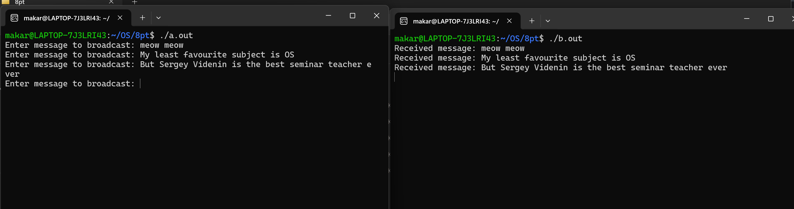

## Кулишенко Макар Андреевич, Домашнее задание 11
### Операционные системы.
*Работа выполнена на 10 баллов*

**Условие:**
Разработать клиент-серверное приложение, использующее UDP и реализующее широковещательную рассылку множества сообщений с сервера. Сообщения с сервера в цикле набираются в консоли и передаются клиентам, запущенным на разных компьютерах. Решение достаточно реализовать на локальной сети. Завершение работы сервера и клиентов в данном случае не оговаривается.

**Решение (8 баллов)**


Рассмотрим основные моменты:

**server.cpp:**

1) Создаем сокет 

```C++
sock = socket(AF_INET, SOCK_DGRAM, 0)
```

2) Выдаем разрешение на широковещательную передачу и настраиваем широковещательный адрес
```C++
setsockopt(sock, SOL_SOCKET, SO_BROADCAST, &broadcastPermission, sizeof(broadcastPermission));
memset(&broadcastAddr, 0, sizeof(broadcastAddr));
broadcastAddr.sin_family = AF_INET;
broadcastAddr.sin_addr.s_addr = inet_addr(BROADCAST_IP);
broadcastAddr.sin_port = htons(BROADCAST_PORT);
```
3) В цикле ожидаем ввода сообщения. В это время клиенты подписываются на сервер для получения сообщений.


**client.cpp:**

1) Аналогично создаем сокет и настраиваем адрес для получения сообщений
2) Выполняем биндинг (связывание) сокета и адреса получателя

```C++
bind(sock, (struct sockaddr *)&recvAddr, sizeof(recvAddr))
```

3) В цикле ждем, пока сервер отправит сообщение и выводим его на экран

**Посмотрим на работу программы:**



**Решение (10 баллов)**

Что поменяется? 

**server.cpp**

```C++
// broadcast - было
#define BROADCAST_IP "255.255.255.255" 
// multicast
#define MULTICAST_GROUP "239.0.0.1" 
// new adress settings
multicastAddr.sin_addr.s_addr = inet_addr(MULTICAST_GROU
P);
```

**client.cpp**

```C++
group.imr_multiaddr.s_addr = inet_addr(MULTICAST_GROUP);
if (setsockopt(sock, IPPROTO_IP, IP_ADD_MEMBERSHIP, (char *)&group, sizeo (group)) < 0) {
    perror("setsockopt");
    close(sock);
    return 1; 
}
```

Спасибо за внимание!