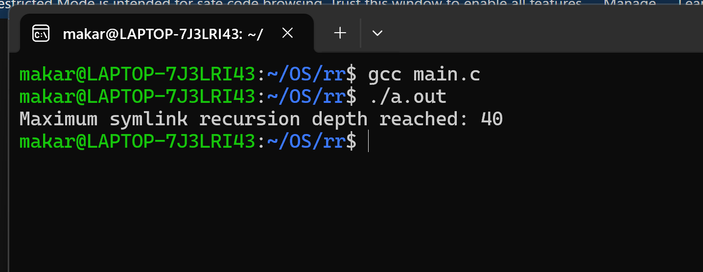

## Кулишенко Макар Андреевич, БПИ226
### Домашнее задание 12, Операционные системы.

### Условие

Необходимо написать программу, определяющую глубину рекурсии для символьных связей при открытии файлов. При запуске программа создает некоторый регулярный файл, допустим, с именем "а". Затем создается символьная связь с именем, например, "aa" на файл "a" и делается попытка открыть файл "аа". Если это удалось, то создается символьная связь с именем, например, "ab" на файл "aa" и делается попытка открыть файл "ab". И так далее, пока открыть файл не удастся. Это и будет означать, что достигyта глубина рекурсии (количества допустимых символьных связей) при открытии файла. Значение глубины рекурсии должно быть выведено на экран.

### Решение:

Программа начинает с создания регулярного файла с именем "a". Этот файл используется в качестве базового для создания символических ссылок.

В цикле программа последовательно создает символические ссылки с именами "symlink_1", "symlink_2" и так далее. Каждая новая символическая ссылка указывает на предыдущую.

После создания каждой новой символической ссылки программа пытается открыть её.
Если открыть ссылку не удается из-за превышения допустимой глубины рекурсии (errno == ELOOP), программа выводит максимальную глубину рекурсии и завершает выполнение.
Если ошибка открытия вызвана другой причиной, программа также завершает выполнение, выводя сообщение об ошибке.

Перед завершением работы программа удаляет все созданные символические ссылки и базовый файл, чтобы не оставлять за собой "мусор".

Код программы находится в файле **main.c**.

Пример работы:

Мы получили, что максимальное значение глубины рекурсии - 40.