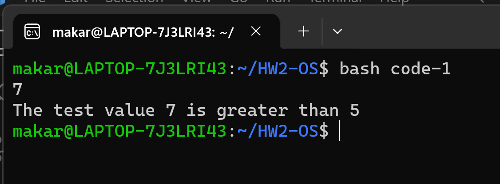
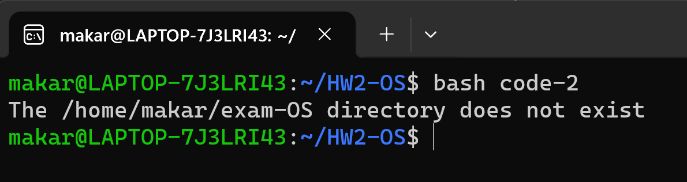
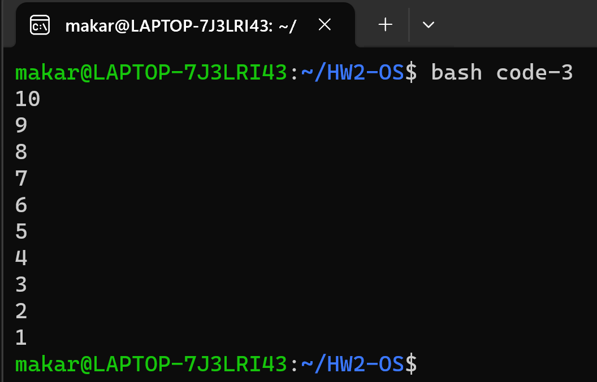
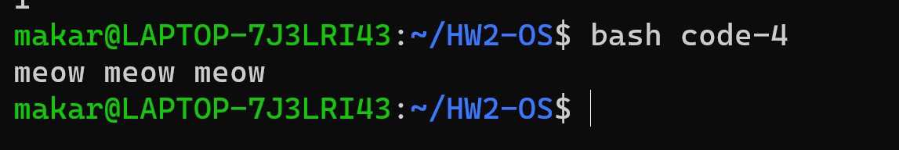
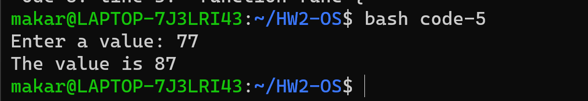

# Операционные системы. ДЗ-2.
## Кулишенко Макар, БПИ226.
***Задание:***

1. Отыскать и привести корректно выполняемые примеры не менее пяти скриптов, использующих следующие инструкций языка bash:
    - if;
    - while;
    - использование функций на bash, вызываемых из других функций.

2. Каждый из примеров снабдить своими комментариями, поясняющими, что данный скрипт делает.

***Приведем примеры скриптов:***

1. Условный оператор. Скрипт 1.

Сравним число, которое пользователь вводит с клавиатуры с числом 5. Для этого будем использовать условный оператор в bash. Все инструкции в комментариях.

``` bash
#!/bin/bash
# Считали из терминала переменную
read a
# Условие: наша переменная больше 5? -gt - оператор "меньше"
if [ $a -gt 5 ]
# Если да, то выведем сообщение об этом
then 
echo "The test value $a is greater than 5"
# Если нет, то сообщим о противоположной ситуации
else
echo "The test value $a is not greater than 5"
# Конец условия
fi
```

Результат работы для числа 7:


2. Условный оператор. Скрипт 2.

Проверим, существует ли директория, указанная в коде.

``` bash
#!/bin/bash
# Зададим директорию
mydir=/home/makar/exam-OS
# Условный оператор: проверим, существует ли директория на компьютере (команда -d проверяет, существует ли файл, и является ли он директорией)
if [ -d $mydir ]
then
# Если да, то выведем сообщение, что она существует и перейдем в нее и посмотрим содержимое
echo "The $mydir directory exists"
cd $ mydir
ls
# Иначе сообщим, что такой директории нет
else
echo "The $mydir directory does not exist"
fi
```

Результат работы:

Такой папки правда нет, есть только папка с домашними заданиями :)

3. Цикл while.

Выведем последоватедьность натуральных чисел от 10 до 1.

``` bash
#!/bin/bash
# Вводим начальное значение
val=10
# Пока выполняется данное условие в скобках, мы ...
while [ $val -lt 0 ]
# ... выполняем команды:
do
# Выводим число на экран
echo $val
# Уменьшаем его на один
val=$[ $val - 1 ]
# Выход из цикла
done
```

Результат работы:


4. Создадим и вызовем функцию, которая будет печатать "meow meow meow"
``` bash
#!bin/bash
# Создадим функцию
meow() {
    echo "meow meow meow"
}

# Главная функция main
main() {
    # Вызываем нашу "мяукающую" функцию
    meow
}

# Вызываем главную функцию
main
```

Результат работы:


5. Создадим и вызовем функцию, которая будет увеличивать введенное число на 10
``` bash
#!/bin/bash
# Создадим функцию, 
function func {
    # Вводим число
    read -p "Enter a value: " value
    # Печатаем результат 
    echo $(( $value + 10 ))
}
# Вызываем функицю и присваиваем значение, которое она возвращает, переменной result
result=$( func)
# Печатаем результат
echo "The value is $result"
```

Результат работы:


Таким образом, были приведены 5 примеров с комментариями.

Спасибо за внимание!