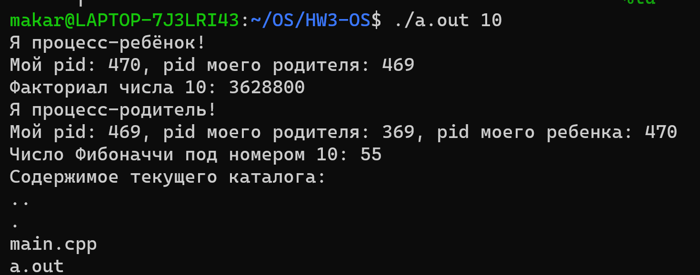
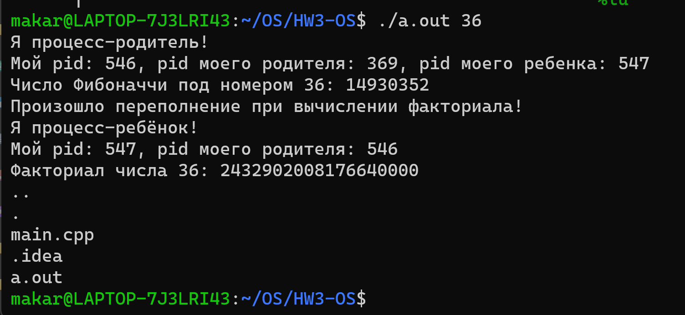

## Кулишенко Макар Андреевич, БПИ226.
### Операционные системы. Домашнее задание 3.
**Условие:**

Разработать программу в которой родительский процесс вычисляет число Фибоначчи, а процесс-ребенок вычисляет значение факториала. В качестве исходного значения используется аргумент из командной строки. Использовать беззнаковую 64-разрядную целочисленную арифметику. Не забыть зафиксировать возникновение переполнения. Для всех процессов вывести на экран дополнительную информацию об их потомках и родителях. Организовать в программе дополнительно запуск процесса, который по завершении вычислений и выводе результатов выводит информацию о содержимом текущего каталога.

**Решение:**

Приведу решение на языке С++. Работа выполнена на 10 баллов.
``` C++
#include <unistd.h>
#include <stdio.h>
#include <stdint.h>
#include <stdlib.h>
#include <iostream>
#include <dirent.h>

uint64_t Fibs(int value) {
    uint64_t a1 = 1;
    uint64_t a2 = 1;
    for (int i = 2; i < value; ++i) {
        if (UINT64_MAX - a1 < a2) {
            printf("Произошло переполнение при вычислении числа Фибоначчи!\n");
            return a2;
        }
        uintptr_t b = a1;
        a1 = a2;
        a2 += b;
    }
    return a2;
}

uint64_t Factortial(int value) {
    uint64_t prod = 1;
    for (int i = 1; i <= value; ++i) {
        if (i > UINT64_MAX / prod) {
            printf("Произошло переполнение при вычислении факториала!\n");
            return prod;
        }
        prod *= i;
    }
    return prod;
}

void PrintDirContents() {
    DIR *dir;
    struct dirent *entry;

    dir = opendir(".");
    if (dir == NULL) {
        perror("Error opening directory");
        return;
    }

    while ((entry = readdir(dir)) != NULL) {
        printf("%s\n", entry->d_name);
    }

    closedir(dir);
}

int main(int argc, char *argv[]) {
    if (argc != 2) {
        printf("Incorrect number of arguments!");
        return -1;
    }
    int input = std::stoi(argv[1]);
    pid_t chpid = fork();
    pid_t pid = getpid();
    pid_t ppid = getppid();
    if (chpid == -1) {
        printf("Ошибка при вызове fork!\n");
        return EXIT_FAILURE;
    } else if (chpid == 0) { // Код процесса-ребенка
        uint64_t factor = Factortial(input);
        printf("Я процесс-ребёнок!\n");
        printf("Мой pid: %d, pid моего родителя: %d\n", pid, ppid);
        printf("Факториал числа %d: %llu\n", input, factor);
    } else { // Код родительского процесса
        uint64_t fib = Fibs(input);
        printf("Я процесс-родитель!\n");
        printf("Мой pid: %d, pid моего родителя: %d, pid моего ребенка: %d\n", pid, ppid, chpid);
        printf("Число Фибоначчи под номером %d: %llu\n", input, fib);
        sleep(5);

        PrintDirContents();

        return 0;
    }
}
```

**Основные моменты:**

1) Функции для вычисления числа Фибоначчи и факториала. Представляют собой циклические алгоритмы на языке С++. Для переменных используем беззнаковый целочисленный 64-разрядный тип. Если наше следующее значение факториала/числа Фибоначчи превышает максимальное значение *uin64_t*, то будем оповещать об этом пользователя и возвращать текущее значение.
2) Функция PrintDirContents(), которая обращается к текущей директории и с помощью цикла выводит информацию о всех файлах, которые в ней находятся.
3) Основная функция main(). В ней мы считываем аргументы командной строки и со помощью функции fork() создаем дочерний процесс. Далее по id процесса мы вычисляем, является ли он дочерним или родительским (для дочернего fork вернет 0). В зависимости от этого, вызываем в каждом из процессов вызываем соответствующую функцию. 

**Запустим программу в командной строке.**

1. Аргумент равен 10



Результат работы корректный!

2. Аргумент равен 36 (для факториала должно произойти переполнение)



Все отлично!

***Спасибо за внимание!***