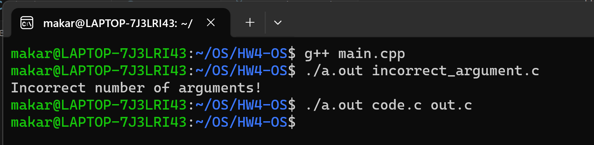

## Кулишенко Макар Андреевич, БПИ 226
### Операционные системы, домашнее задание 4.
Код программы содержится в файле main.cpp.

***Работа выполнена на 10 баллов***

Краткое описание работы программы:
1) Создаём необходимые переменные и константы - задаем размер буфера, создаем буфер для чтения и записи (размер равен размеру, заданному выше), переменные для хранения файловых дескрипторов.
2) Получаем файловые дескрипторы файлов для чтения и записи. Если файлы не удается открыть, выводим сообщение об этом.
3) В цикле считываем по 32 байта исходного файла для чтения до тех пор, пока размер читаемой части не станет менее 32, что означает прочтение последней "порции" байтов. После чтения записываем байты из буффера в файл для записи.
4) С помощью структуры fstat получаем значения режим доступа исходных файлов, а далее присваиваем их файлу, в который происходила запись.
5) Закрываем файлы.

Пример работы программы:

После этого содержимое файла out.cpp будет в точности повторять файл code.c (оба файла будут лежать в папке рядом с файлом main.cpp).

**Спасибо за внимание!**