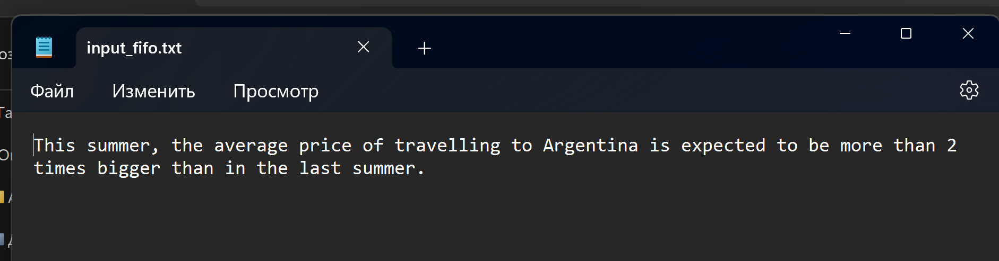
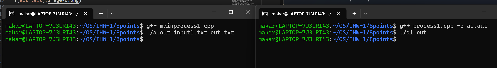

#  Кулишенко Макар Андреевич, БПИ-226.
## Индивидуальное домашнее задание-1 по курсу "Операционные системы" 
## Вариант 5. Работа выполнена на 8 баллов

## Условие

Разработать программы, состоящую из нескольких параллельных про-
цессов, взаимодействующих между собой через каналы. Количество программ в задании из их характеристики определяются в соответствии с
требованиями выполнения на соответствующую оценку. 

Разработать программу, заменяющую все строчные гласные буквы
в заданной ASCII–строке **заглавными**.

## Решение (4 балла).

Код программы представлен в файле main.cpp. Наборы входных данных для всех программ лежат в папке test_files.

***Общая схема решаемой задачи:***

В данной программе взаимодействуют 3 процесса. Основной процесс принимает на вход название входного и выходного файла, а также создает 2 неименованных канала(пайпа), которые будут использоваться для передачи данных между процессами

Первый дочерний процесс занимается чтением данных из файла в буфер фиксированной длины. Предварительно он закрывает конец канала, отвечающий за чтение, чтобы без лишних читателей записать туда данные, считанные из файла.

Через первый канал передаются данные от процесса 1 к процессу 2. Второй процесс закрывает конец канала для записи и считывает из него массив символов. Далее второй процесс отвечает за обработку полученных данных согласно условию задачи. Внутри потока вызывается необходимая функция, которая в результате работы возвращает новую строку. Далее через второй канал данные передаются от процесса 2 к процессу 3.

Процесс 3 считывает данные из второго канала, предварительно закрыв его конец, отвечающий за запись, и записывает полученную строку в выходной файл.

Основные ошибки при работе с каналами или процессами обработаны. Если возникает ошибка, пользователю выводится сообщение об этом.

Тестовые входные файлы имеют названия input\<number>.txt, а выходные - output\<number>.txt.

Покажу пример работы программы на одном из входных файлов:

1. Скомпилируем и запустим программу


2. Посмотрим на результат работы

**input:**


**output**


Все хорошо!

## Решение (5 баллов).

Код программы представлен в файле main1.cpp

Здесь мы вместо неименованных пайпов перейдем к именованным каналам. 
Теперь они будут создаваться немного иначе. 

```C++
// Defining named pipes
    const char *fifo1 = "fifo1";
    const char *fifo2 = "fifo2";

    // Creating named pipes (FIFOs)
    if (mkfifo(fifo1, S_IFIFO | 0666) < 0 || mkfifo(fifo2,  S_IFIFO | 0666) < 0) {
        printf("Fifo creating error");
        exit(1);
    }
```

Еще: теперь не надо закрывать неиспользуемый конец канала, так как здесь мы можем открыть именованный канал только для одного действия (чтение/запись).

В остальном алгоритм решения задачи **не** изменился, только незначительные изменения в коде.

Для тестирования используются файлы, указанные в пункте на 4.

Можем посмотреть на работу данной программы на примере файла input_fifo.txt
 
1. Скомпилируем и запустим программу


2. Посмотрим на результат работы

**input:**


**output:**


Отлично!


## Решение (6 баллов).

Код программы представлен в файле main2.cpp

***Общая схема решаемой задачи:***

В данной программе взаимодействуют 2 процесса. Основной процесс принимает на вход название входного и выходного файла, а также создает 2 неименованных канала(пайпа), которые будут использоваться для передачи данных между процессами. Далее данный процесс считывает данные из входного файла и через pipe1 передает их дочернему процессу.

Дочерний процесс занимается чтением данных из первого пайпа в буфер фиксированной длины. Предварительно он закрывает конец канала, отвечающий за запись, чтобы никакой другой процесс не мог начать запись в пайп во время чтения. 

После этого дочерний процесс обрабатывает данные в соотв. с условием задачи и через pipe2 передает данные обратно в процесс-родитель. 

Далее процесс-родитель считывает из pipe2 данные и записыват их в выходной файл.

Основные ошибки при работе с каналами или процессами обработаны. Если возникает ошибка, пользователю выводится сообщение об этом.

Для тестирования используются файлы, указанные в пункте на 4.

Можем посмотреть на работу данной программы на примере файла input_pipe_2.txt
 
1. Скомпилируем и запустим программу


2. Посмотрим на результат работы

**input:**


**output:**


Perfetto!

## Решение (7 баллов).

Код программы представлен в файле main3.cpp

Общая идея решения остается такой же, как и в пункте на 6 баллов.
Из новшеств: заменили неименованные пайпы на именованные каналы, причем в начале добавили опцию удаления fifo'в, если они уже были созданы другой программой ранее. 

1. Скомпилируем и запустим программу


2. Посмотрим на результат работы

**input:**


**output**


## Решение (8 баллов).

Код программы представлен в папке 8points в виде двух файлов: mainprocess1.cpp - файл программы (основной), которая считывает данные из файла, а затем через именованный канал передает их второй программе process1.cpp.

***Общая схема решаемой задачи:***

В данной программе взаимодействуют 2 независимых процесса. Назовем основным процессом тот, что воспроизводит чтение и запись в файлы.

С помощью терминала запускаем одновременно две программы. Желательно запустить первой основную программу. Далее основная программа считывает данные из файла и открывает первый канал для записи. Затем записывает в него данные, которые считывает уже вторая программа. Далее она производит обработку строки согласно заданию и записывает во второй канал преобразованные данные. Затем основная программа считывает их уже из второго канала и записывает в файл. 

Можем посмотреть на работу данной программы на примере файла input1.txt
 
1. Скомпилируем и запустим **обе** программы



2. Посмотрим на результат работы


Остальные 4 набора тестовых данных с результатами лежат в папке с решением 4-7 пунктов.
