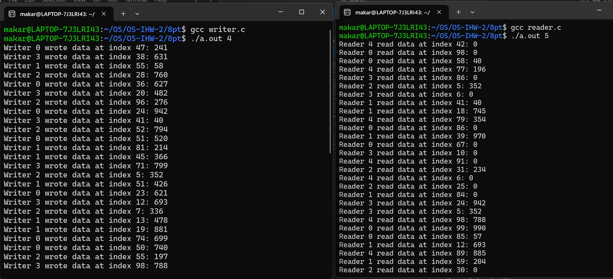

## Кулишенко Макар Андреевич, БПИ-226.
### Индивидуальное домашнее задание-2 по курсу "Операционные системы".
### Вариант 7. Работа выполнена на 9 баллов
### Условие:
Базу данных, представленную массивом целых положительных чисел, разделяют два типа процессов: **N** читателей и **K** писателей. 

- Читатели периодически просматривают случайные записи базы данных и выводя номер свой номер (например, PID), индекс записи, ее значение, а также вычисленное значение, которое является произведением числа на номер записи.
- Писатели изменяют случайные записи на случайное число и также выводят информацию о своем номере, индексе записи, старом значении и новом значении.
- Предполагается, что в начале БД находится в непротиворечивом состоянии (все числа отсортированы). Каждая отдельная новая запись переводит БД из одного непротиворечивого состояния в другое (то есть, новая сортировка может поменять индексы записей или переставить числа).
- Транзакции выполняются в режиме «подтвержденного чтения», то есть процесс-писатель не может получить доступ к БД в том случае, если ее занял другой процесс–писатель или
процесс–читатель.
- К БД может обратиться одновременно сколько угодно процессов–читателей.
- Процесс читатель получает доступ к БД, даже если ее уже занял процесс–писатель.
- Создать многопроцессное приложение с потоками-писателями и потоками-читателями.
Каждый читатель и писатель моделируется отдельным процессом.

### Решение (4-5 баллов)
Требования:

1. Представить сценарий решаемой задачи поясняющий, каким образом исходные сущности и их поведение отображаются в процессы и их взаимодействие.

> В данной задаче родительский процесс генерирует **N** процессов-читателей **K** процессов-писателей. **N** и **K** вводятся через аргументы командной строки. Читатели и писатели - основные сущности программы. Для каждого читателя и писателя создается свой процесс, причем процессы взаимодействуют между собой с помощью семафоров POSIX. Для синхронизации и взаимодействия были созданы 2 семафора и структура **Database**, хранящая буфер и счетчик количества читателей, которые в текущий момент читают из буфера. Структура хранится в разделяемой памяти, которая создается в начале работы программы. Один семафор (семафор читателя) используется для блокировки при увеличении числа читателей буфера. Семафор писателя устроен сложнее и изменяется как внутри функции писателя, так и внутри функции читателя. Рассмотрим второй случай подробнее. Писателям запрещено заходить в буфер, где уже находятся читатели. Поэтому если число читателей превышает 1, то он блокируется. И наоборот, если из буфера вышли все читатели, то семафор открывается. Программа выполняется бесконечно до прерывания пользователем.


2. В зависимости от выбранной схемы решения программа может использовать обмен данными через общую или разделяемую память. Применение семафоров в программе возможно по одному из следующих вариантов (на выбор разработчика):

- Множество процессов взаимодействуют с использованием именованных POSIX семафоров. Обмен данными ведется через разделяемую память в стандарте POSIX.

- Множество процессов взаимодействуют с использованием неименованных POSIX семафоров расположенных в разделяемой памяти. Обмен данными также ведется через разделяемую память в стандарте POSIX.

> Для реализации я выбрал именованные семафоры POSIX.

3. Реализовать завершение программы в соответствии с условием задачи, а также предусмотреть корректное завершение по прерыванию с клавиатуры по соответствующему сигналу.

> В программе реализована обработка сигнала SIGINT при нажатии Ctrl + C во время работы программы. 

4. В программе предусмотреть удаление семафоров и разделяемой
памяти по ее завершению любым из способов.

> Для очистки и удаления семафоров, а также разделяемой памяти, я написал метод cleanup(), который вызывается в конце работы программы и при прерывании с помошью сигнала.
5. Результаты работы программы должны быть отражены в отчете.

> Приведу результаты работы:

В качестве первоначальных значений массива я использовал квадраты натуральных чисел от 1 до 100. Писатели генерируют случайный индекс, а также случайное число в диапазоне от db[index - 1] до db[index + 1], чтобы сохранялось непротиворечивое состояние массива.



Полный код программы находится в файле **main.c**

### Решение (6-7 баллов)

Заменим именованные семафоры на неименованные, расположенные в разделяемой памяти. 

Для этого создадим 2 новых объекта разделяемой памяти, в которых будут храниться наши семафоры.

Пример работы программы:


Весь код можно найти в файле **main2.c**

### Решение (8 баллов)

Здесь придется внести большие изменения в код.

Для начала, создадим отдельные файлы reader.c, writer.c и database.h. 

Файл reader.c содержит функцию работы процесса-читателя, а также main, который запускает эти процессы.

Файл writer.c содержит функцию работы процесса-писателя, а также main, который запускает эти процессы.

В файле database.h находится структура, содержащая информацию об общем буфере и текущем числе читателей. 

Для связи между читателями и писателями используется разделяемая память, в которой находится буфер и массив семафоров, состоящих из семафора для читателя и семафора для писателя (аналогично предыдущим пунктам). 

Для решения данной задачи используются семафоры System V, которые мы создаем в reader.c и writer.c. Затем мы получаем область разделяемой памяти, в которой будут находиться данные семафоры

В методе main мы обращаемся к разделяемой памяти. Например, в reader.c 

```
if ((shmid = shmget(shm_key, sizeof(Database), 0666 | IPC_CREAT | IPC_EXCL)) < 0)  {
        if ((shmid = shmget(shm_key, sizeof(Database), 0)) < 0) {
            perror("shmget");
            exit(EXIT_FAILURE);
        }
        db = (Database*)shmat(shmid, NULL, 0);
    } else {
        db = (Database*)shmat(shmid, NULL, 0);
        for(int i = 0; i < BUFFER_SIZE; ++i) {
            db->data[i] = 0;
        }
    }

    // Create reader semaphore
    sem_reader_id = semget(shm_key, 1, IPC_CREAT | IPC_EXCL | 0666);
    if (sem_reader_id == -1) {
        if ((sem_reader_id = semget(shm_key, 1, 0666)) == -1) {
            perror("semget (reader)");
            exit(EXIT_FAILURE);
        }
    } else {
        if (semctl(sem_reader_id, 0, SETVAL, 1) == -1) {
            perror("semctl (reader)");
            exit(EXIT_FAILURE);
        }
    }
```

Посмотрим на результат работы программы. Для запуска нужно использовать K + N терминалов. 


Полный код программы можно найти в папке 8pt в файлах reader.c, writer.c и database.h

### Решение (9 баллов)

Изменим механизм взаимодействия между процессами. Теперь они будут взаимодействовать через семафоры System V и очереди сообщений.

Условие задания требует, чтобы был некоторый общий буфер, куда по случайному индексу могут обращаться читатели и писатели. К сожалению, условие задачи требует, чтобы мы не использовали разделяемую память, поэтому пусть писатели обращаются к читателям через очередь сообщений и говорят, что "записали" в некоторую случайную позицию (индекс они передают) число, которое надо считать читателю.

Добавим очереди сообщений вместо  разделяемой памяти:
```
queue_id = msgget(87, 0666 | O_CREAT);
    if (queue_id == -1) {
        perror("msgget");
        exit(EXIT_FAILURE);
    }
```

Изменим файл database.h. Теперь здесь будет находится функция инициализации семафоров, а также функции, которые необходимо вызывать при завершении программы.

```
#include <sys/sem.h>
#include <sys/ipc.h>
#include <errno.h>
#include <stdbool.h>

const int OPEN_FLAGS_EXIST = 0666;
const int OPEN_FLAGS_NEW = 0666 | IPC_CREAT | IPC_EXCL;

inline int create_semaphore_or_increase(key_t sem_key,
                                        uint32_t sem_initial_value) {
    int sem_id = semget(sem_key, 1, OPEN_FLAGS_NEW);
    const bool failed = sem_id == -1 && errno != EEXIST;
    if (failed) {
        perror("semget");
        return sem_id;
    }

    const bool sem_already_exists = sem_id == -1;
    if (sem_already_exists) {
        sem_id = semget(sem_key, 1, OPEN_FLAGS_EXIST);
    }

    if (sem_id == -1) {
        perror("semget");
        return sem_id;
    }

    if (!sem_already_exists) {
        printf("Created new semaphore[sem_id=%d]\n", sem_id);
        if (semctl(sem_id, 0, SETVAL, sem_initial_value) == -1) {
            perror("semctl");
            if (semctl(sem_id, 0, IPC_RMID) == -1) {
                perror("shmctl");
            } else {
                printf(
                        "Could not init semaphore value. Deleted "
                        "semaphore[sem_id=%d]\n",
                        sem_id);
            }
            return -1;
        }
    } else {
        printf("Opened existing semaphore[sem_id=%d]\n", sem_id);
        struct sembuf buffer = {
                .sem_num = 0,
                .sem_op  = 1,
                .sem_flg = 0,
        };
        if (semop(sem_id, &buffer, 1) == -1) {
            perror("semop");
            return -1;
        }
    }

    return sem_id;
}


inline void delete_semaphore(int sem_id) {
    if (sem_id == -1) {
        return;
    }
    if (semctl(sem_id, 0, IPC_RMID) == -1) {
        perror("semctl");
    } else {
        printf("Deleted semaphore[sem_id=%d]\n", sem_id);
    }
}

inline void delete_queue(int queue_id) {
    if (queue_id == -1) {
        return;
    }
    if (msgctl(queue_id, IPC_RMID, NULL) == -1) {
        perror("msgctl");
    } else {
        printf("Deleted queue[queue_id=%d]\n", queue_id);
    }
}

void deinit_queue(int queue_id, int sem_id) {

    if (sem_id == -1 || queue_id == -1) {
        return;
    }

    struct sembuf buffer = {
            .sem_num = 0,
            .sem_op  = -1,
            .sem_flg = IPC_NOWAIT,
    };
    if (semop(sem_id, &buffer, 1) == -1) {
        bool counter_is_zero = errno == EAGAIN;
        if (counter_is_zero) {
            return;
        }

        perror("semop");
    }
    switch (semctl(sem_id, 0, GETVAL)) {
        case -1:
            perror("semctl");
            break;
        case 0:
            delete_semaphore(sem_id);
            delete_queue(queue_id);
            break;
        default:
            break;
    };
}
```

А также внутри цикла добавим структуру, которую будем передавать через очередь:
```
struct msgbuf {
    long mtype;
    int index;
    int value;
};

struct msgbuf buffer = {
        .mtype = 1,
        .index = index,
        .value = value
};
```
Теперь наши процессы будут взаимодействовать с помощью семафоров и очередей сообщений. Запустим нашу программу (снова запускается с двух и более терминалов).


Ура! Все работает!

Исходный код можно найти в папке 9pt в файлах reader.c, writer.c и database.h

На этом все! Спасибо за внимание!


