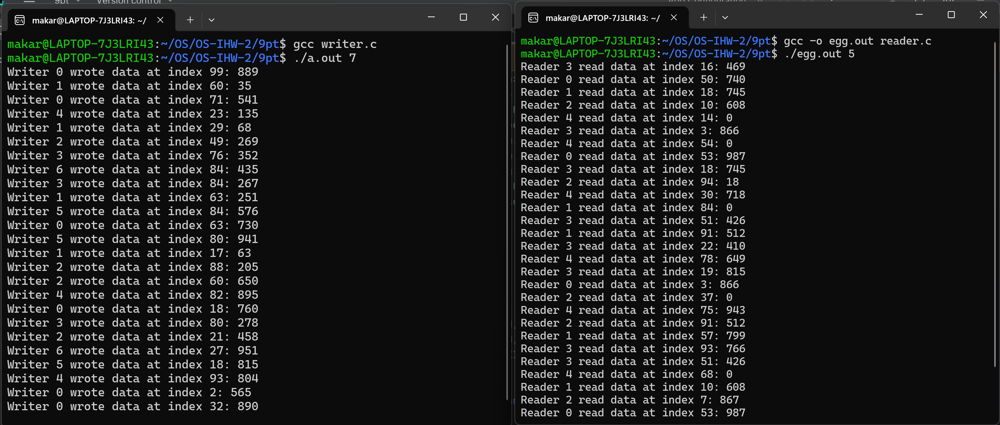

## Кулишенко Макар Андреевич, БПИ-226.
### Индивидуальное домашнее задание-2 по курсу "Операционные системы".
### Вариант 7. Работа выполнена на n баллов
### Условие:
Базу данных, представленную массивом целых положительных чисел, разделяют два типа процессов: **N** читателей и **K** писателей. 

- Читатели периодически просматривают случайные записи базы данных и выводя номер свой номер (например, PID), индекс записи, ее значение, а также вычисленное значение, которое является произведением числа на номер записи.
- Писатели изменяют случайные записи на случайное число и также выводят информацию о своем номере, индексе записи, старом значении и новом значении.
- Предполагается, что в начале БД находится в непротиворечивом состоянии (все числа отсортированы). Каждая отдельная новая запись переводит БД из одного непротиворечивого состояния в другое (то есть, новая сортировка может поменять индексы записей или переставить числа).
- Транзакции выполняются в режиме «подтвержденного чтения», то есть процесс-писатель не может получить доступ к БД в том случае, если ее занял другой процесс–писатель или
процесс–читатель.
- К БД может обратиться одновременно сколько угодно процессов–читателей.
- Процесс читатель получает доступ к БД, даже если ее уже занял процесс–писатель.
- Создать многопроцессное приложение с потоками-писателями и потоками-читателями.
Каждый читатель и писатель моделируется отдельным процессом.

### Решение (4-5 баллов)
Требования:

1. Представить сценарий решаемой задачи поясняющий, каким образом исходные сущности и их поведение отображаются в процессы и их взаимодействие.

> В данной задаче родительский процесс генерирует **N** процессов-читателей **K** процессов-писателей. **N** и **K** вводятся через аргументы командной строки. Читатели и писатели - основные сущности программы. Для каждого читателя и писателя создается свой процесс, причем процессы взаимодействуют между собой с помощью семафоров POSIX. Для синхронизации и взаимодействия были созданы 2 семафора и структура **Database**, хранящая буфер и счетчик количества читателей, которые в текущий момент читают из буфера. Структура хранится в разделяемой памяти, которая создается в начале работы программы. Один семафор (семафор читателя) используется для блокировки при увеличении числа читателей буфера. Семафор писателя устроен сложнее и изменяется как внутри функции писателя, так и внутри функции читателя. Рассмотрим второй случай подробнее. Писателям запрещено заходить в буфер, где уже находятся читатели. Поэтому если число читателей превышает 1, то он блокируется. И наоборот, если из буфера вышли все читатели, то семафор открывается. Программа выполняется бесконечно до прерывания пользователем.

2. В зависимости от выбранной схемы решения программа может использовать обмен данными через общую или разделяемую память. Применение семафоров в программе возможно по одному из следующих вариантов (на выбор разработчика):

- Множество процессов взаимодействуют с использованием именованных POSIX семафоров. Обмен данными ведется через разделяемую память в стандарте POSIX.

- Множество процессов взаимодействуют с использованием неименованных POSIX семафоров расположенных в разделяемой памяти. Обмен данными также ведется через разделяемую память в стандарте POSIX.

> Для реализации я выбрал именованные семафоры POSIX.

3. Реализовать завершение программы в соответствии с условием задачи, а также предусмотреть корректное завершение по прерыванию с клавиатуры по соответствующему сигналу.

> В программе реализована обработка сигнала SIGINT при нажатии Ctrl + C во время работы программы. 

4. В программе предусмотреть удаление семафоров и разделяемой
памяти по ее завершению любым из способов.

> Для очистки и удаления семафоров, а также разделяемой памяти, я написал метод cleanup(), который вызывается в конце работы программы и при прерывании с помошью сигнала.
5. Результаты работы программы должны быть отражены в отчете.

> Приведу результаты работы:

В качестве первоначальных значений массива я использовал квадраты натуральных чисел от 1 до 100. Писатели генерируют случайный индекс, а также случайное число в диапазоне от db[index - 1] до db[index + 1], чтобы сохранялось непротиворечивое состояние массива.

Полный код программы находится в файле **main.c**

### Решение (6-7 баллов)

Заменим именованные семафоры на неименованные, расположенные в разделяемой памяти. 

Для этого создадим 2 новых объекта разделяемой памяти, в которых будут храниться наши семафоры.

Пример работы программы:

Весь код можно найти в файле **main2.c**

## TBC...