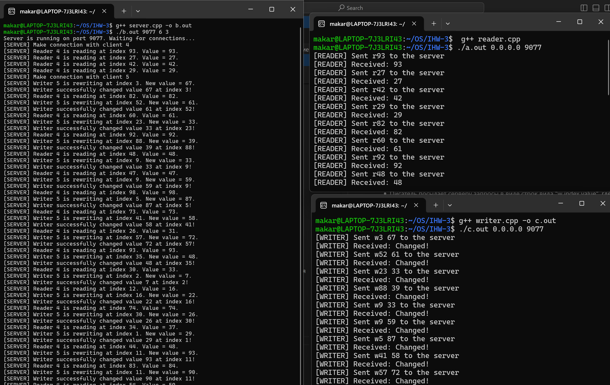
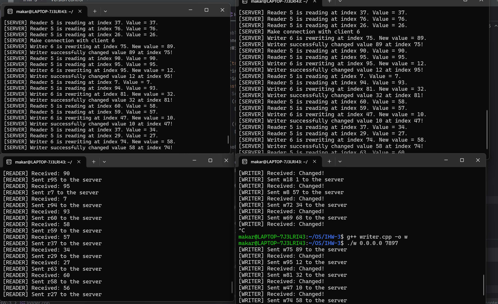
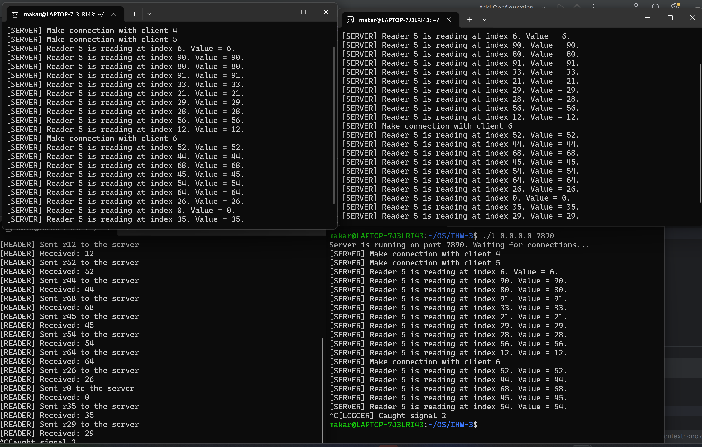
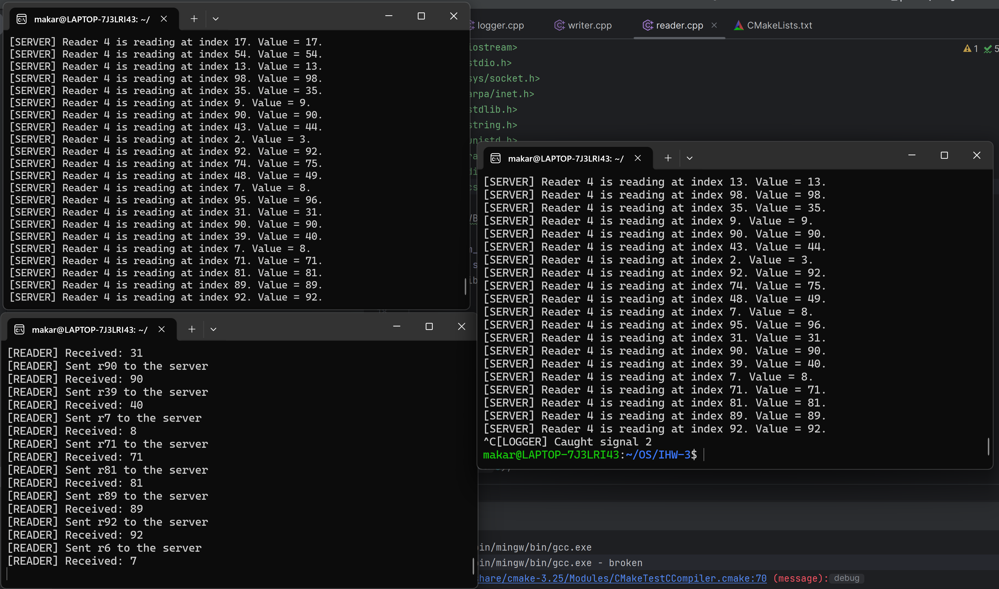
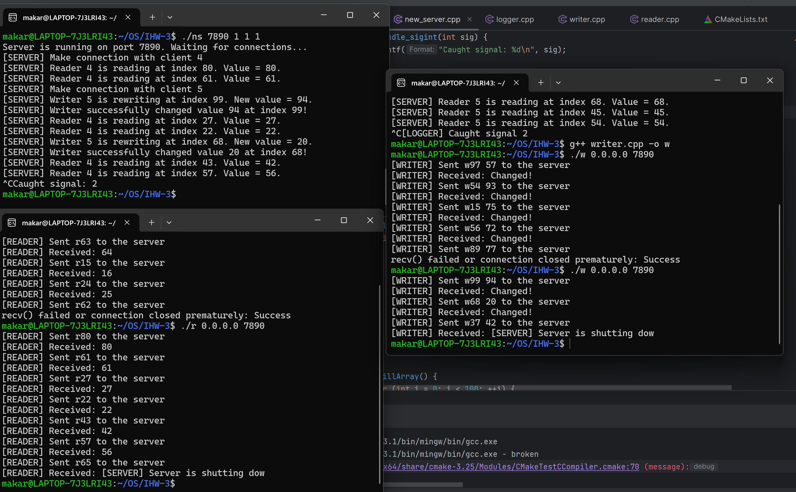

## Кулишенко Макар Андреевич, БПИ226
### Индивидуальное домашнее задание-3 по курсу "Операционные системы".
### Вариант 7. Работа выполнена на 10 баллов.

### Условие:
Задача о читателях и писателях («подтвержденное чтение»). Базу данных представленную массивом целых положительных чисел, разделяют два типа процессов: N читателей и K писателей. Читатели периодически просматривают случайные записи базы данных и выводя номер свой номер (например, PID), индекс записи, ее значение, а также вычисленное значение, которое является произведением числа на номер записи. Писатели изменяют случайные записи на случайное число и также выводят информацию о своем номере, индексе записи, старом значении и новом значении. Предполагается, что в начале БД находится в непротиворечивом состоянии (все числа отсортированы). Каждая отдельная новая запись переводит БД из одного непротиворечивого состояния в другое (то есть, новая сортировка может поменять индексы записей или переста-
вить числа). Транзакции выполняются в режиме «подтвержденного чтения», то есть процесс-писатель не может получить доступ к БД в том случае, если ее занял другой процесс–писатель или процесс–читатель. К БД может обратиться одновременно сколько угодно процессов–читателей. 

Создать клиент–серверное приложение с процессами–писателями и процессами–читателями. Сервер моделирует базу данных. Все писатели и все читатели — два разных клиента, в каждом из которых возможна конкуренция параллельных процессов или потоков. Каждый процесс — это отдельный писатель или отдельный читатель внутри сервера.

### Решение (4-5 баллов)

**Идея решения:**

- Создадим 3 сущности: сервер, клиент-читатель и клиент-писатель.
- Каждая из них - отдельная программа. Клиенты подключаются к серверу через TCP-протокол.
- Каждый клиент обрабатывается сервером в отдельном потоке. Изначальное количество потоков = K + N, где K - число писателей, а N - количество читателей.
- Аргументы командной строки для сервера: порт, число читателей и число писателей.
- Аргументы командной строки для клиентов: IP-адрес сервера и номер порта. 
- На сервере хранится база данных (массив) из 100 ячеек с числами. Изначально он заполнен возрастающей последовательностью от 0 до 99.
- Читатель посылает серверу запросы в виде строк вида "r index", где r - знак того, что сейчас поступил запрос от читателя, а index - случайный индекс от 0 до 99, означающий индекс элемента в массиве из 100 чисел, который хранится на сервере.
- Сервер обрабатывает запросы читателя и возвращает ему число, которое находится в массиве под соотв. индексом.
- Писатель посылает серверу запросы в виде строк вида "w index value", где w - знак того, что сейчас поступил запрос от писателя, index - случайный индекс от 0 до 99, означающий индекс элемента в массиве из 100 чисел, который хранится на сервере, а value - новое значение, которое писатель хочет записать в массив на позицию index.
- Действия читателей и писателей синхронизируются с помощью pthread-мьютексов и pthread-условных переменных согласно правилам из условия
- Клиент отключается от сервера, если отправляет ему индекс -1.


**Реализация решения:**

- Создадим три отдельных файла, которые будут функционировать независимо друг от друга. 
- Сервер содержит основной метод *main*, в котором происходит настройка сокета, биндинг и запуск сервера на прием сообщений от клиентов
- Клиент-читатель и клиент-писатель представляют независимые процессы, которые между собой не взаимодействуют. Синхронизация их работы происходит с помощью мьютекса и conditional variable. 

Рассмотрим важные функции сервера:

1. SendMessage и ChangeValue. Первая функция отправляет клиенту сообщение (либо значение по индексу, либо результат успешной замены значения писателем). Вторая - меняет значение в базе данных по индексу. Перед вызовом проводится проверка индекса на корректность, а внутри данной функции - смена значения, оповещение клиента и возвращение базы данных в непротиворечивое состояние.
```C++
void SendMessageToClient(int clntSocket, const std::string &message) {
    if (send(clntSocket, message.c_str(), message.length(), 0) != message.length()) {
        DieWithError("send() failed");
    }
}

void ChangeValue(int current_client_socket, int index, int number) {
    database[index] = number;
    printf("[SERVER] Writer successfully changed value %d at index %d!\n", number, index);
    SendMessageToClient(current_client_socket, "Changed!");
    std::sort(std::begin(database), std::end(database));
}
```

2. HandleReader - получает на вход сокет клиента и его сообщение. Блокирует мьютекс для того, чтобы писатели не могли проникать в этот блок до тех пор, пока все читатели не выйдут. Далее обрабатываем строку: извлекаем из нее индекс, по котором будем читать, и проверяем его на корректность. Если индекс корректный, то отправляем клиенту значение базы данных, которое находилось под этим индексом.
```C++
void HandleReader(int current_client_socket, const std::string &string) {
    pthread_mutex_lock(&mtx);
    while (writer_active) {
        pthread_cond_wait(&cv, &mtx);
    }
    ++active_readers;
    pthread_mutex_unlock(&mtx);

    try {
        int index = std::stoi(string.substr(1));
        if (index >= 0 && index < ARRSIZE) {
            std::string message = std::to_string(database[index]);
            printf("[SERVER] Reader %d is reading at index %d. Value = %d.\n", current_client_socket,
                   index, database[index]);
            SendMessageToClient(current_client_socket, message);
        } else {
            SendMessageToClient(current_client_socket, "[SERVER->READER] Index out of range");
        }
    } catch (const std::invalid_argument &e) {
        SendMessageToClient(current_client_socket, "[SERVER->READER] Invalid index");
    }

    pthread_mutex_lock(&mtx);
    --active_readers;
    if (active_readers == 0) {
        pthread_cond_broadcast(&cv);
    }
    pthread_mutex_unlock(&mtx);
}
```
Аналогичная функция (немного другая) есть и для писателя. 

Полная программная реализация (подробная) находится в файлах **server.cpp**, **reader.cpp**, **writer.cpp** и **diewitherror.cpp** внутри папки **4-5 points**. 

**Посмотрим на работу программы:**



Видим, что клиенты работают, не мешая друг другу, при этом можно заметить, что после работы писателя некоторые значения базы данных не равны индексу, а значит, программа работает корректно.

### Решение (6-7 баллов)

**Требования**

В дополнение к программе на предыдущую оценку необходимо разработать отдельную клиентскую программу, подключаемую к серверу, которая предназначена для отображение комплексной информации о выполнении приложения в целом. То есть, данный программный модуль должен адекватно и в полном виде отображать поведение моделируемой системы (информацию передаваемую на сервер и информацию, порождаемую сервером), позволяя не пользоваться отдельными видами, предоставляемыми клиентами и серверами по отдельности

Создадим отдельный файл **logger.cpp**, который будет вести себя как обычный клиент. Он будет отправлять серверу сообщение "l", которое будет являться запросом на свежие логи. 

В сервере создадим переменную logger (string), которая будет накапливать в себе логи сервера до тех пор, пока клиент-логгер не запросит их. Чтобы не дудосить сервер, клиент-логгер будет отправлять запросы один раз в секунду. Изначально инициализируем строку нулем (просто нулем, можно любым другим символом) для того, чтобы сервер не отправлял клиенту-логгеру пустую строку, после которой тот завершит свое функционирование.

После каждого вывода информации на экран сервер будет безопасно добавлять ее к строке (почему безопасно? добавление защищено новым мьютексом, который не позволит множеству клиентов-логгеров одновременно проникнуть к строке и записать туда свежие логи). 

При отправке логгером запроса, сервер будет отсылать строку logger клиенту-логгеру, который будет выводить ее на экран.

Для корректности работы вместо зануления строки будем присваивать ей "0", который будем убирать при дополнении. Это позволит клиенту-логгеру не получить пустой ответ от сервера, который приведет к отключению клиента.

Некоторые фукнции:

- SaveLog - добавляет новый лог к строке. Если она пустая,

```C++
void SafeLog(const char *message) {
    pthread_mutex_lock(&logsem);
    if (logger == "0") {
        logger = "";
    }
    logger += std::string(message);
    pthread_mutex_unlock(&logsem);
}
```

Новый код можно найти в папочке **6-7 points** в файле **logger.cpp**. Замечу, что сервер также изменился, поэтому важно подключать новый файл только к новому варианту сервера. 

Посмотрим на работу: 



Отлично!

### Решение (8 баллов)

**Требования**

В дополнение к предыдущей программе реализовать возможность, подключения множества клиентов, обеспечивающих отображение информации о работе приложения. Это должно позволить осуществлять наблюдение за поведением программы с многих независимых компьютеров.

Для выполнения данного условия необходимо поменять аргументы командной строки для сервера (будем принимать пятым аргументом максимальное количество таких наблюдателей).

```C++
if (argc != 5)     /* Test for correct number of arguments */
    {
        fprintf(stderr, "Usage:  %s <Server Port> <Readers> <Writers>\n", argv[0]);
        exit(1);
    }

    echoServPort = atoi(argv[1]);  /* First arg:  local port */
    readers = atoi(argv[2]);       /* Second arg: number of readers */
    writers = atoi(argv[3]);       /* Third arg: number of writers */
    observers = atoi(argv[4]);
    N = writers + readers + observers;

```

Чтобы можно было подключать несколько логгеров без потери информации, доработаем код, добавив map <int, int>, где ключ - сокет клиента, а значение - индекс последнего символа, который передали логгеру.

Принцип работы следующий:

- Как только запускает сервер, начинается логгирование информации в переменную logger. 

- Когда подключается новый логгер, в map мы создаем новую пару с ключом, равным сокету подключенного логгера. Далее передаем все содержимое строки logger и меняем индекс в словаре на длину строки.

- При подключении нового клиента-логгера, ему будет доступна вся строка (в отличие от решения на 6-7 баллов, где мы ее зануляли). 

- Добавим функцию cleanup, которая будет очищать строку-логгер в сервере каждые 10 секунд во избежание переполнения.

- Таким образом, при подключении новых клиентов-логгеров им будет доступна информация обо всех логах (за 10 секунд до их подключения), при этом никакие данные не будут затираться одним доминирующим логгером.
```C++
void cleanup() {
    logger = "0";
    for (auto &pair : logs) {
        pair.second = 0;
    }
    sleep(10);
}
```

- Функция отправки новых логов клиенту-логгеру:

```C++
void SendLogsToClient(int clntSocket, const std::string &message, int index) {
    std::string message1 = message.substr(index);
    if (index == message.length()) {
        message1 = "0";
    }
    if (send(clntSocket, message1.c_str(), message1.length(), 0) != message1.length()) {
        DieWithError("send() failed");
    }
}
```
Пример подключения нескольких логгеров, а затем их дальнейшего отключения без потери работоспособности:



Здесь мы видим, что клиент-логгер в правом нижнем углу отключился, при этом остальное приложение работает.

Как обычно, более подробный код в папке **8 points**.

### Решение (9 баллов)

Помимо этого, обработаем возможность корректного завершения программы: добавим обработчик сигналов во все файлы. Если мы вызовем Ctrl + C в клиенте, то он поймает данный сигнал, обработает его и отправит сообщение 'q' серверу. Сервер, получив данное сообщение, закончит цикл работы с данным клиентом и завершит поток. При этом, все остальные потоки смогут спокойно функционировать.

```C++
void handle_sigint(int sig) {
    printf("[LOGGER] Caught signal %d\n", sig);
    const char *message = "q";
    send(sock, message, strlen(message), 0);
    close(sock);
    exit(0);
}
```

Покажу пример работы программы, когда мы завершили работу логгера и писателя, но при этом читатель и сервер функционируют отлично!



Как обычно, более подробный код в папке **9 points**.

### Решение (10 баллов)

Изменим функцию обработки сигнала в сервере:

```C++
void handle_sigint(int sig) {
    printf("Caught signal: %d\n", sig);

    // Notify all clients about server shutdown
    pthread_mutex_lock(&logsem);
    for (int client_socket : client_sockets) {
        SendMessageToClient(client_socket, "[SERVER] Server is shutting down.");
        close(client_socket);
    }
    pthread_mutex_unlock(&logsem);

    exit(0);
}
```

Для этого добавим в сервер список всех сокетов клиентов, которые будут добавляться туда при подключении.

Если сервер получает сигнал ctrl + c, то клиентам поступает сообщение: Server is shutting down, после чего соединение безопасно закрывается


Как обычно, более подробный код в папке **10 points**.

### Спасибо за внимание!