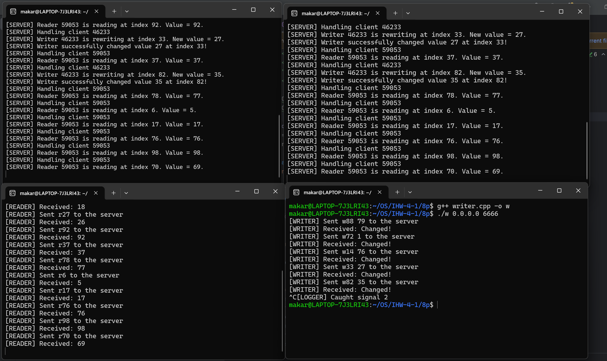

## Кулишенко Макар Андреевич, БПИ226
### Индивидуальное домашнее задание-4, Операционные системы.
### Вариант 7.  Работа выполнена на 10 баллов.

### Условие:
Задача о читателях и писателях («подтвержденное чтение»). Базу данных представленную массивом целых положительных чисел, разделяют два типа процессов: N читателей и K писателей. Читатели периодически просматривают случайные записи базы данных и выводя номер свой номер (например, PID), индекс записи, ее значение, а также вычисленное значение, которое является произведением числа на номер записи. Писатели изменяют случайные записи на случайное число и также выводят информацию о своем номере, индексе записи, старом значении и новом значении. Предполагается, что в начале БД находится в непротиворечивом состоянии (все числа отсортированы). Каждая отдельная новая запись переводит БД из одного непротиворечивого состояния в другое (то есть, новая сортировка может поменять индексы записей или переста-
вить числа). Транзакции выполняются в режиме «подтвержденного чтения», то есть процесс-писатель не может получить доступ к БД в том случае, если ее занял другой процесс–писатель или процесс–читатель. К БД может обратиться одновременно сколько угодно процессов–читателей. 

Создать клиент–серверное приложение с процессами–писателями и процессами–читателями. Сервер моделирует базу данных. Все писатели и все читатели — два разных клиента, в каждом из которых возможна конкуренция параллельных процессов или потоков. Каждый процесс — это отдельный писатель или отдельный читатель внутри сервера.

### Решение (4-5 баллов)

**Идея решения:**

- Создадим 3 сущности: сервер, клиент-читатель и клиент-писатель.
- Каждая из них - отдельная программа. Клиенты подключаются к серверу через UDP-протокол.
- Так как взаимодействие клиентов и сервера осуществляется через протокол UDP, то конкуренции между процессами нет, они обрабатываются сервером в порядке поступления
- Аргументы командной строки для сервера: порт, число читателей и число писателей.
- Аргументы командной строки для клиентов: IP-адрес сервера и номер порта. 
- На сервере хранится база данных (массив) из 100 ячеек с числами. Изначально он заполнен возрастающей последовательностью от 0 до 99.
- Читатель посылает серверу запросы в виде строк вида "r index", где r - знак того, что сейчас поступил запрос от читателя, а index - случайный индекс от 0 до 99, означающий индекс элемента в массиве из 100 чисел, который хранится на сервере.
- Сервер обрабатывает запросы читателя и возвращает ему число, которое находится в массиве под соотв. индексом.
- Писатель посылает серверу запросы в виде строк вида "w index value", где w - знак того, что сейчас поступил запрос от писателя, index - случайный индекс от 0 до 99, означающий индекс элемента в массиве из 100 чисел, который хранится на сервере, а value - новое значение, которое писатель хочет записать в массив на позицию index.
- Сервер отправляет читателю в ответ число - значение в массиве под переданным индексом, а писателю - строчку Successfully changed, которая означает, что значение было успешно изменено.
- Клиент отключается от сервера с помощью сигналы SIGINT или если он сгенерировал индекс, равный 0.

**Реализация решения:**

- Создадим три отдельных файла, которые будут функционировать независимо друг от друга. 
- Сервер содержит основной метод *main*, в котором происходит настройка сокета, биндинг и запуск сервера на прием сообщений от клиентов
- Клиент-читатель и клиент-писатель представляют независимые процессы, которые между собой не взаимодействуют. 

Основные важные функции сервера: 

1. SendMessage и ChangeValue. Первая функция отправляет клиенту сообщение (либо значение по индексу, либо результат успешной замены значения писателем). Вторая - меняет значение в базе данных по индексу. Перед вызовом проводится проверка индекса на корректность, а внутри данной функции - смена значения, оповещение клиента и возвращение базы данных в непротиворечивое состояние.
```C++
void SendMessageToClient(int sock, const std::string &message) {
    if (sendto(sock, message.c_str(), message.length(), 0,
               (struct sockaddr *) &echoClntAddr, sizeof(echoClntAddr)) != message.length())
        DieWithError("sendto() sent a different number of bytes than expected");
}


void ChangeValue(int sock, int index, int number) {
    database[index] = number;
    printf("[SERVER] Writer successfully changed value %d at index %d!\n", number, index);
    SendMessageToClient(sock, "Changed!");
    std::sort(std::begin(database), std::end(database));
}
```

Обе функции похожи на те, что были в ИДЗ-3 на TCP, только теперь вместо send() используется sendto() c другими параметрами.

2. HandleReader - получает на вход сокет сервера и сообщение. Проверяет корректность индекса, который передает читатель, и передает ему значение базы данных под этим индексом.
```C++
void HandleReader(int sock, const std::string &string) {
    try {
        int index = std::stoi(string.substr(1));
        if (index >= 0 && index < ARRSIZE) {
            std::string message = std::to_string(database[index]);
            printf("[SERVER] Reader %s is reading at index %d. Value = %d.\n", inet_ntoa(echoClntAddr.sin_addr),
                   index, database[index]);
            SendMessageToClient(sock, message);
        } else {
            SendMessageToClient(sock, "[SERVER->READER] Index out of range");
        }
    } catch (const std::invalid_argument &e) {
        SendMessageToClient(sock, "[SERVER->READER] Invalid index");
    }
}
```
Аналогичная функция (немного другая) есть и для писателя:
```C++
void HandleWriter(int sock, const std::string &string) {
    std::size_t firstSpace = string.find(' ');
    if (firstSpace == std::string::npos) {
        SendMessageToClient(sock, "[SERVER->WRITER] Invalid input");
        return;
    }
    std::string indexStr = string.substr(1, firstSpace - 1);
    std::string numberStr = string.substr(firstSpace + 1);

    int index = 0;
    int number = 0;

    try {
        index = std::stoi(indexStr);
        number = std::stoi(numberStr);
    } catch (const std::exception &e) {
        SendMessageToClient(sock, "[SERVER->WRITER] Invalid arguments");
        return;
    }

    if (index >= 0 && index < ARRSIZE && number < 1000) {
        printf("[SERVER] Writer %s is rewriting at index %d. New value = %d.\n", inet_ntoa(echoClntAddr.sin_addr),
               index, number);
        ChangeValue(sock, index, number);

    } else {
        SendMessageToClient(sock, "[SERVER->WRITER] Index out of range");
    }
}
```

А получение сообщения и его первичную обработку выполняет функция **HandleUDPClient**. Она принимает сообщение от клиента и выбирает, какому обработчику его передать.
```C++
void HandleUDPClient(int sock) {
    int cliAddrLen = sizeof(echoClntAddr);

    char *buffer = new char[ECHOMAX];        /* Buffer for string */
    int recvMsgSize;                            /* Size of received message */

    if ((recvMsgSize = recvfrom(sock, buffer, ECHOMAX, 0,
                                (struct sockaddr *) &echoClntAddr, (socklen_t *) &cliAddrLen)) < 0)
        DieWithError("recvfrom() failed");

    printf("[SERVER] Handling client %s\n", inet_ntoa(echoClntAddr.sin_port));

    buffer[recvMsgSize] = '\0'; // Null terminate the string
    std::string string(buffer);
    switch (buffer[0]) {
        case 'r':
            HandleReader(sock, string);
            break;
        case 'w':
            HandleWriter(sock, string);
            break;
        default:
            break;
    }

    delete[] buffer;
}
```

Полная программная реализация (подробная) находится в файлах **server.cpp**, **reader.cpp**, **writer.cpp** и **diewitherror.cpp** внутри папки **4-5 points**. 

Пример работы программы:


### Решение (6-7 баллов)

**Требования**

В дополнение к программе на предыдущую оценку необходимо разработать отдельную клиентскую программу, подключаемую к серверу, которая предназначена для отображение комплексной информации о выполнении приложения в целом. То есть, данный программный модуль должен адекватно и в полном виде отображать поведение моделируемой системы (информацию передаваемую на сервер и информацию, порождаемую сервером), позволяя не пользоваться отдельными видами, предоставляемыми клиентами и серверами по отдельности

Создадим отдельный файл **logger.cpp**, который будет вести себя как обычный клиент. Он будет отправлять серверу сообщение "l", которое будет являться запросом на свежие логи. 

В сервере создадим переменную logger (string), которая будет накапливать в себе логи сервера до тех пор, пока клиент-логгер не запросит их. Чтобы не дудосить сервер, клиент-логгер будет отправлять запросы один раз в секунду. Изначально инициализируем строку нулем (просто нулем, можно любым другим символом) для того, чтобы сервер не отправлял клиенту-логгеру пустую строку, после которой тот завершит свое функционирование.


После каждого вывода информации на экран сервер будет безопасно добавлять ее к строке. Безопасность гарантируется UDP-протокол. 

При отправке логгером запроса, сервер будет отсылать строку logger клиенту-логгеру, который будет выводить ее на экран.

Для корректности работы вместо зануления строки будем присваивать ей "0", который будем убирать при дополнении. Это позволит клиенту-логгеру не получить пустой ответ от сервера, который приведет к отключению клиента.

Стоит добавить, что по правилам UDP клиент-логгер подключается каждый раз заново, поэтому необходимо создать словарь, где ключом будет порт клиента-логгера, а значением - индекс строки, который последний раз был прочитан логгером. Таким образом, при повторном подключении логгер будет выводить только новую информацию. А строчку с подключением клиента-логгера сервер передаст только один раз.

Некоторые фукнции (аналогичны тем, что в ИДЗ-3):

- SaveLog - добавляет новый лог к строке. Если логов не было, то вместо нуля присваивает пустую строку ддя того, чтобы 0 не отправлялся клиенту.
- cleanup - очищает логгер каждые 10 секунд (во избежание переполнения) и зануляет индексы.
- SendLogsToClient - отправляет клиенту данные логгера с индекса, где он остановился.

```C++
void cleanup() {
    logger = "0";
    for (auto &pair : logs) {
        pair.second = 0;
    }
    sleep(10);
}

void SafeLog(const char *message) {
    if (logger == "0") {
        logger = "";
    }
    logger += std::string(message);
}

void SendLogsToClient(int sock, const std::string &message, int index) {
    std::string message1 = message.substr(index);
    if (index == message.length()) {
        message1 = "0";
    }
    if (sendto(sock, message1.c_str(), message1.length(), 0,
               (struct sockaddr *) &echoClntAddr, sizeof(echoClntAddr)) != message1.length())
        DieWithError("sendto() sent a different number of bytes than expected");
}

```

Новый код можно найти в папочке **6-7 points** в файле **logger.cpp**. Замечу, что сервер также изменился, поэтому важно подключать новый файл только к новому варианту сервера. 

Посмотрим на работу (логгер в правом верхнем углу): 


Отлично!

### Решение (8 баллов)

**Требования**

В дополнение к предыдущей программе реализовать возможность, подключения множества клиентов, обеспечивающих отображение информации о работе приложения. Это должно позволить осуществлять наблюдение за поведением программы с многих независимых компьютеров.

Когда мы реализовывали решение на 6-7 баллов, мы уже предусмотрели систему, когда у каждого клиента-логгера есть свой порт, который фиксируется в словаре по ключу которого можно найти индекс, с которого начинается новый лог. И каждому логгеру будет доступна информация о последних 10 секундах работы сервера до момента его подключения.

Осталось предусмотреть, чтобы отключения таких клиентов не влияли на работу программы.
Для этого добавим обработчик сигнала SIGINT (Ctrl + C) в логгер. Если он получит такой сигнал, то завершит свою работу. При этом на работе сервера это никак не скажется, поскольку нет никакого связывания между клиентом и сервером.

```C++
void handle_sigint(int sig) {
    printf("[LOGGER] Caught signal %d\n", sig);
    exit(0);
}

// И в main:
signal(SIGINT, handle_sigint);
````


Здесь в правой части представлены два логгера. Сначала мы запускаем сервер, читателя и верхний логгер. Спустя несколько секунд отключаем его командой Ctrl + C и включаем второй логгер. Так как прошло менее 10 секунд, то второй логгер выведет логи с самого начала.

Отлично!

### Решение (9 баллов)

**Требования**
В дополнение к программам на предыдущие оценки необходимо разработать приложение, позволяющее отключать и подключать различных клиентов с сохранением работоспособности сервера. После этого можно вновь запускать отключенных клиентов, чтобы приложение в целом могло продолжить свою работу. Отчет расширить информацией о добавленной реализации и привести соответствующие результаты работы программы.

По умолчанию, клиент (читатель или писатель) завершает свою работу, если генерирует индекс, равный 0. При этом они сами отключаются, не трогая сервер. Добавим в них обработчик аварийного завершения с помощью Ctrl + C.

Аналогично пункту на 8 баллов, добавим в читателя и писателя:
```C++
// writer
void handle_sigint(int sig) {
    printf("[WRITER] Caught signal %d\n", sig);
    exit(0);
}

// reader
void handle_sigint(int sig) {
    printf("[READER] Caught signal %d\n", sig);
    exit(0);
}
```
Попробуем последовательно отключить всех клиентов:

1. Writer



2. Logger


3. Reader


А теперь снова запустим какого-нибудь клиента. Например, читателя.


Мы видим, что сервер продолжил свою работу. Ура! Подробный код в папке **9 points**

### Решение (10 баллов)

В решаемой мной задаче сервер не завершает свою работу, даже если от него отключились все клиенты, поскольку они смогут подключиться вновь. Пусть сервер завершил работы под воздействием внешнего фактора. 

Добавим в клиентов функциональность для завершения работы, если ответ от сервера не получен в течение 5 секунд. Для этого мы используем функцию select для установки тайм-аута на ожидание данных.

```C++
fd_set fds;
struct timeval timeout;
FD_ZERO(&fds);
FD_SET(sock, &fds);

timeout.tv_sec = 5;
timeout.tv_usec = 0;

int fromSize = sizeof(fromAddr);
int selectResult = select(sock + 1, &fds, nullptr, nullptr, &timeout);
```

- Если данные поступили (selectResult > 0), то продолжаем выполнение и вызываем recvfrom.
- Если произошел тайм-аут (selectResult == 0), выводим сообщение и завершаем работу клиента.
- Если произошла ошибка (selectResult < 0), вызываем DieWithError.

Пример работы: сервер неожиданно завершил работу, при этом клиент **не** упал, а вывел сообщение и завершил свою работу.


Как обычно, более подробный код в папке **10 points**.

На этом все! Спасибо за два последних идз, они были интересные!

### Спасибо за внимание!


